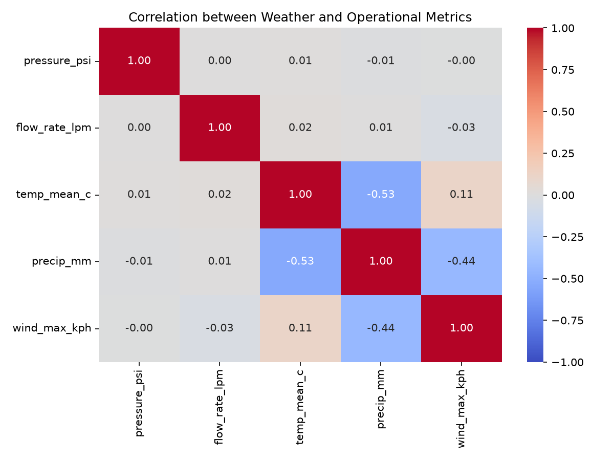

# Week 3 – Multi‑Source Data Pipeline

This project implements a complete **multi‑source data pipeline** that integrates internal operational data, live weather data from a public API, and a supplementary holiday calendar stored in a SQLite database. The merged dataset is then used for correlation analysis to uncover relationships between operational metrics and external factors.

The pipeline is delivered as a fully documented **Jupyter Notebook** (`week3_multi_source_pipeline.ipynb`) that fulfills the requirements of the coding challenge (Part A). It is designed for reproducibility, readability, and robust error handling.

---

## Table of Contents
- [Overview](#overview)
- [Repository Contents](#repository-contents)
- [Requirements](#requirements)
- [Setup](#setup)
- [Running the Notebook](#running-the-notebook)
- [Data Sources](#data-sources)
- [Integration and Merging](#integration-and-merging)
- [Analysis and Results](#analysis-and-results)
- [Visualisation](#visualisation)
- [Extensions and Future Work](#extensions-and-future-work)
- [Additional Deliverables (Parts B & C)](#additional-deliverables-parts-b--c)
- [License](#license)
- [Author](#author)

---

## Overview

The notebook:

1. **Loads** a cleaned operational dataset from a CSV file (`clean_operational_events.csv`).
2. **Fetches** daily weather data from the Open‑Meteo Archive API for the relevant date range (with graceful failure).
3. **Creates** a SQLite database (using SQLAlchemy) with a `holidays` table containing Kenyan public holidays.
4. **Queries** the database using **`JOIN` and `GROUP BY`** to:
   - Flag each operational record as a holiday or not.
   - Compute daily summary aggregates (average pressure, flow rate, temperature, incident count, maintenance count) grouped by date and holiday status.
5. **Merges** all three sources into a single **master DataFrame**.
6. **Analyses** the data by computing:
   - Pearson correlation between weather variables and operational metrics.
   - Average pressure on holidays vs. non‑holidays.
7. **Visualises** the correlation matrix with a heatmap.

---

## Repository Contents

| File | Description |
|------|-------------|
| `week3_multi_source_pipeline.ipynb` | Main Jupyter notebook (fully commented). |
| `clean_operational_events.csv` | Cleaned operational dataset from Week 2 (provided). |
| `correlation_heatmap.png` | Heatmap visualisation of the correlation matrix. |
| `README.md` | This file. |

The notebook also generates (on the fly):
- `supplementary.db` – SQLite database with `holidays` table.
- `correlation_heatmap.png` – the heatmap image.

---

## Requirements

- Python 3.8+
- The following Python packages (install via `pip`):

```bash
pip install pandas numpy requests sqlalchemy matplotlib seaborn
```

---

## Setup

1. **Clone** this repository or download the files into a local directory.
2. Ensure `clean_operational_events.csv` is in the same folder as the notebook.
3. (Optional) Create a virtual environment to isolate dependencies.
4. Install the required packages (see above).

---

## Running the Notebook

Launch Jupyter Notebook from the terminal:

```bash
jupyter notebook week3_multi_source_pipeline.ipynb
```

Then execute all cells sequentially (Kernel → Restart & Run All). The notebook will:

- Load and preprocess the CSV data.
- Call the weather API (handles failures gracefully).
- Build the SQLite database, insert holidays, and run two SQL queries (JOIN and JOIN + GROUP BY).
- Merge all sources into a master DataFrame.
- Output correlation matrices and display a heatmap.

The notebook is heavily commented, so each step explains the source, transformation, and purpose of the data.

---

## Data Sources

### 1. Internal Operational Data (`clean_operational_events.csv`)
- **Columns**: `record_id`, `event_timestamp_utc`, `depot_id`, `depot_name`, `region`, `product_code`, `pressure_psi`, `flow_rate_lpm`, `temperature_c`, `incident_flag`, `maintenance_required`, etc.
- A `event_date` column is derived from the timestamp for merging.

### 2. External Weather API (Open‑Meteo)
- **Endpoint**: `https://archive-api.open-meteo.com/v1/archive`
- **Parameters**: latitude, longitude, date range (derived from CSV), daily variables (temperature, precipitation, wind speed).
- **Error handling**: If the API fails, the notebook continues with `NaN` weather values and prints a warning.

### 3. Supplementary Database (Holidays)
- **Engine**: SQLite (created in‑memory or persisted as `supplementary.db`).
- **Table**: `holidays` with `holiday_date` and `holiday_name`.
- **SQL queries**:
  - `JOIN` only – adds `is_holiday` flag and holiday name to each row.
  - `JOIN` + `GROUP BY` – computes daily aggregates by date and holiday status.
- Both queries are loaded into DataFrames using `pd.read_sql`.

---

## Integration and Merging

- The row‑level data (with holiday flag) is merged with weather data on `event_date` (**left join**).
- The resulting DataFrame is then merged with the daily summary aggregates on `(event_date, is_holiday)` to enrich each row with daily statistics.

Missing weather values remain `NaN` (no imputation is performed in this version).

---

## Analysis and Results

### Correlation Matrix
- Numeric columns: `pressure_psi`, `flow_rate_lpm`, `temp_mean_c`, `precip_mm`, `wind_max_kph`.
- Pearson correlation is computed on rows with complete weather data.

From the analysis:

| Variable Pair | Correlation |
|---------------|-------------|
| `precip_mm` vs `flow_rate_lpm` | **0.007** (almost none) |
| `precip_mm` vs `pressure_psi` | **-0.010** (negligible) |
| `temp_mean_c` vs `pressure_psi` | **0.014** (weak positive) |
| `wind_max_kph` vs `flow_rate_lpm` | **-0.034** (weak negative) |

**Conclusion:** Rainfall does **not** significantly correlate with lower throughput or pressure in this dataset. Weather factors have a very weak influence on operational metrics.

### Holiday Effect
The date range (March – April 2026) does not include any of the listed Kenyan public holidays (Jan 1, May 1, Jun 1, Oct 10, Oct 20, Dec 12, Dec 25, Dec 26). Therefore, `is_holiday` is always 0, and the holiday‑pressure comparison cannot be performed for this period. However, the SQL logic is correct and would work when holidays fall within the data window.

---

## Visualisation

The correlation matrix is visualised as a heatmap:



---

## Extensions and Future Work

- **Imputation**: Fill missing weather values using interpolation or nearby weather stations.
- **Additional sources**: Incorporate commodity prices, traffic data, or social media sentiment.
- **Automation**: Schedule the notebook with `cron` or Apache Airflow for daily updates.
- **Great Expectations**: Replace manual checks with a formal validation suite.

---

## License

This project is for educational purposes as part of a data engineering lab.

---

## Author

Prepared for the **Week 3** multi‑source data integration exercise. For questions, refer to the lab instructions or contact the instructor.
```

---